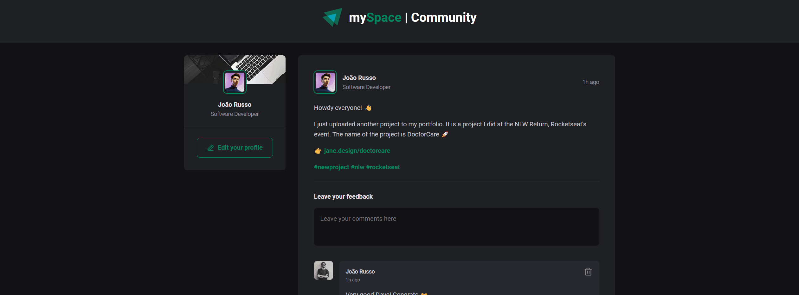

# 🧑‍💻 Feed page for mySpace - Social Network

<strong>mySpace</strong> is a personal project which is about a fictitious social network that emphasizes connecting the professional with the social, human to human. For this, a <strong>minimalist, responsive and dynamic design was idealized.</strong>

----------------------------------------------------------------

## ⚜️Table of contents

- [Overview](#overview)
- [My process](#my-process)
----
## ⚜️Overview

<h3 align="center">
Desktop version:

</h3>
<h3 align="center">
Mobile version:

</h3>

----------------------------------------------------------------

## ⚜️My process

### Built with

- Semantic HTML5 markup
- Framework Vite
- React JS
- CSS-Modules

----------------------------------------------------------------
